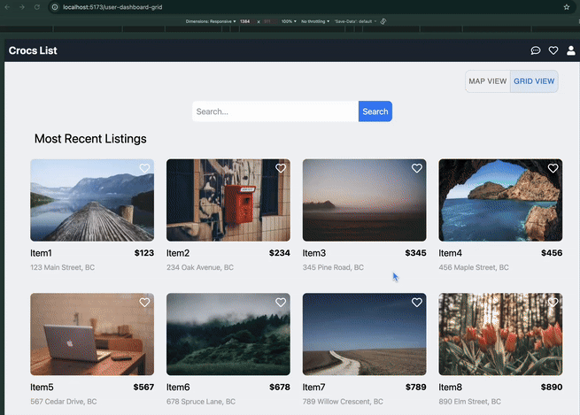
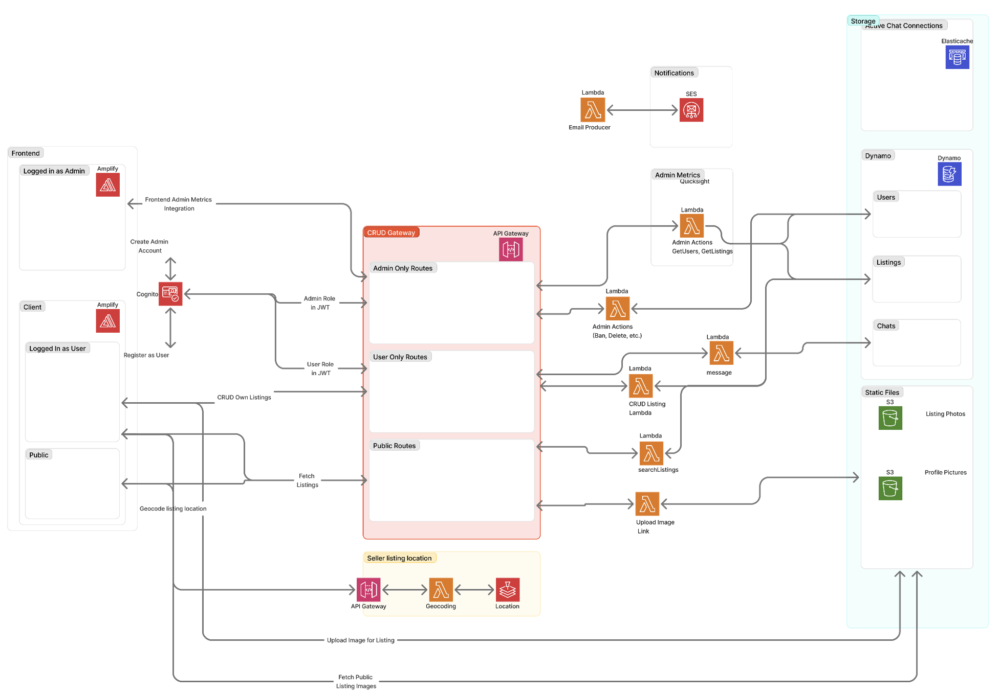
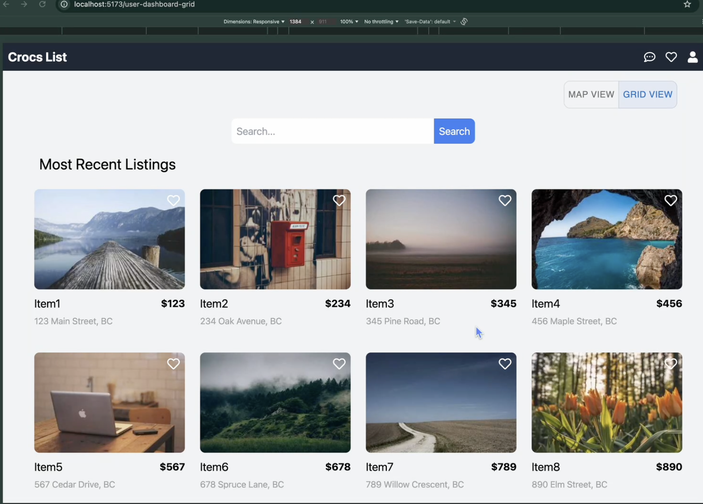
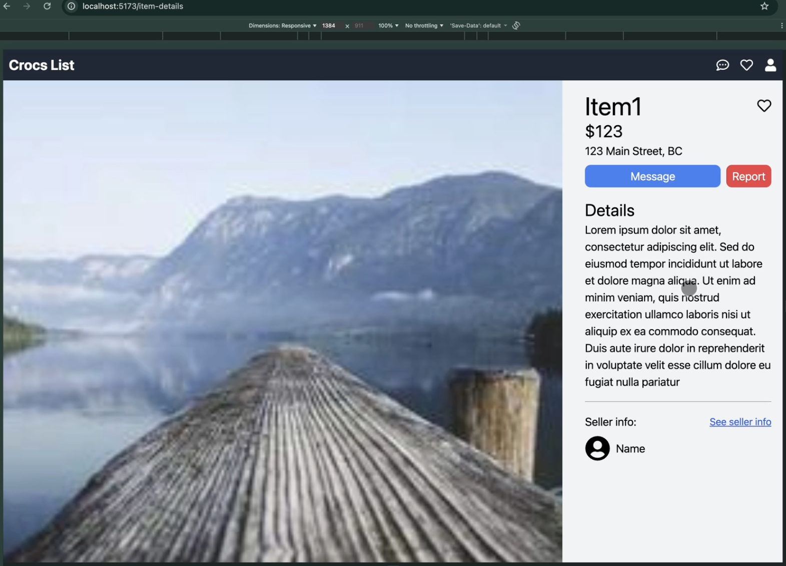
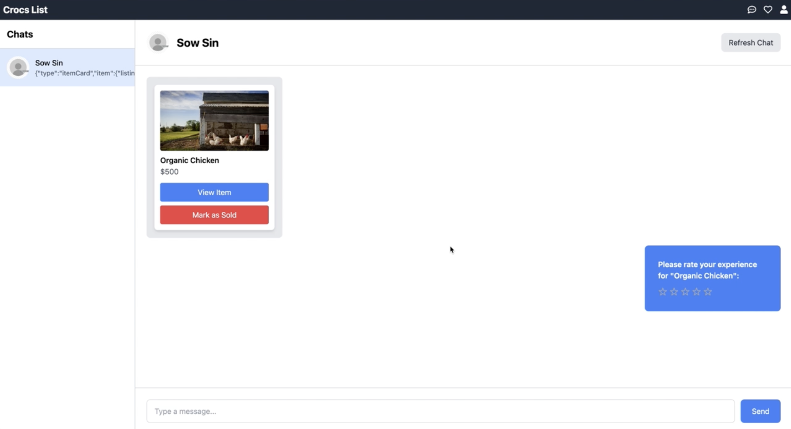

# CrocsList



## Table of Contents

- [Summary](#summary)
- [Motivation](#motivation)
- [Requirements](#requirements)
- [Tech Stack](#tech-stack)
- [Architecture](#architecture)
- [Quick Start](#quick-start)
- [Features](#features)
- [API Endpoints](#api-endpoints)
- [Project Structure](#project-structure)
- [Contributors](#contributors)
- [Gallery](#gallery)

## Summary

CrocsList is a full-stack marketplace application built with React and AWS CDK that enables users to buy and sell items with features including search, map-based browsing, favorites, messaging, and admin moderation tools.

## Motivation

CrocsList was developed as a collaboration between 11 developers to demonstrate proficiency in modern full-stack development, serverless architecture, and AWS cloud infrastructure. The project showcases skills in building responsive user interfaces, implementing authentication flows, managing listings with photo uploads, and deploying scalable serverless applications using AWS CDK, Lambda, DynamoDB, Cognito, and S3.

## Requirements

- Node.js 18+ and npm
- AWS CLI configured with appropriate credentials
- AWS CDK CLI (`npm install -g aws-cdk`)
- Python 3.9+ (for Lambda functions)
- AWS account with permissions to deploy CDK stacks

## Tech Stack

**Frontend:**

- React, React Router DOM, Vite
- TypeScript / JavaScript
- Tailwind CSS, PostCSS
- Material-UI (MUI)
- Leaflet / MapLibre GL for map functionality

**Backend:**

- TypeScript (AWS CDK infrastructure)
- Python (Lambda functions)

**Cloud Infrastructure:**

- AWS CDK (TypeScript)
- AWS Lambda (Python)
- Amazon DynamoDB
- Amazon Cognito (User & Admin authentication)
- Amazon API Gateway (REST API)
- Amazon S3 (Listing photos)
- AWS Amplify
- Amazon SES (Simple Email Service)
- AWS CloudFormation
- AWS Secrets Manager
- AWS Location Services
- AWS Organizations

## Architecture



## Quick Start

### Clone the repository:

```bash
git clone https://github.com/izcheung/crocsList.git
cd crocsList
```

### Backend Setup

1. Navigate to the backend directory:

```bash
cd backend
```

2. Install dependencies:

```bash
npm install
```

3. Build the TypeScript code:

```bash
npm run build
```

4. Deploy the CDK stack (requires AWS credentials):

```bash
aws sso login --profile <your-profile-name>  # If using AWS SSO
npx cdk deploy
```

⚠️ **Note:** The backend requires AWS credentials and appropriate permissions. The CDK stack will create all necessary AWS resources including Cognito user pools, DynamoDB tables, Lambda functions, API Gateway, and S3 buckets.

### Frontend Setup

1. Navigate to the frontend directory:

```bash
cd frontend
```

2. Install dependencies:

```bash
npm install
```

3. Start the development server:

```bash
npm run dev
```

### Admin Frontend Setup

1. Navigate to the admin-frontend directory:

```bash
cd admin-frontend
```

2. Install dependencies:

```bash
npm install
```

3. Start the development server:

```bash
npm run dev
```

## Features

### User Features

**User Authentication:**

- Sign up and sign in functionality with AWS Cognito
- Email confirmation flow
- Resend confirmation code
- JWT-based session management
- User profile management

**Listing Management:**

- Create, read, update, and delete listings
- Upload listing photos to S3
- View detailed listing information
- Mark listings as sold
- Report inappropriate listings

**Search and Discovery:**

- Search listings by name
- Filter by category (tops, bottoms, dresses, outerwear, accessories, footwear)
- Sort by price (ascending/descending) or date (ascending/descending)
- Browse listings in grid view
- View listings on interactive map with location markers
- Toggle between map and grid views

**Favorites:**

- Add listings to favorites
- View all favorited listings
- Remove items from favorites

**Chat:**

- Messaging between users
- View all chat conversations
- Send and receive messages
- Chat history persistence

**User Profiles:**

- View own profile
- View seller profiles and their rating/reviews
- Edit profile information

### Admin Features

**Admin Dashboard:**

- View statistics (active listings, deleted listings, total users, reported listings)
- Visual charts and analytics
- Manage all listings
- View and manage reported listings
- Delete inappropriate listings
- View all registered users

## API Endpoints

The application uses AWS API Gateway with the following endpoint structure:

### Authentication (`/auth`)

- `POST /auth/signup` → Create new user account
- `POST /auth/signin` → Authenticate user and receive JWT token
- `POST /auth/confirm` → Confirm user email
- `POST /auth/resend` → Resend confirmation code

### Public Endpoints (`/public`)

- `GET /public/search` → Search listings (supports query, sort, tags parameters)
- `GET /public/listing` → Get listing by ID
- `GET /public/userListings` → Get listings by user ID

### User Endpoints (`/user`) - Requires Authentication

**Listings:**

- `POST /user/listings` → Create new listing
- `PATCH /user/listings` → Update listing
- `DELETE /user/listings` → Delete listing
- `POST /user/listings/photo` → Upload listing photo

**Favorites:**

- `GET /user/favourites` → Get all favorited listings
- `POST /user/favourites` → Add listing to favorites
- `DELETE /user/favourites` → Remove listing from favorites
- `GET /user/favouritedListings` → Get favorited listings with details

**Chat:**

- `POST /user/chat/sendMessage` → Send message in chat
- `GET /user/chat/getMessages` → Get messages for a chat thread
- `GET /user/chat/getAllChats` → Get all chat conversations

### Admin Endpoints (`/admin`) - Requires Admin Authentication

- `GET /admin/getAllListings` → Get all listings
- `GET /admin/reported-listings` → Get reported listings
- `POST /admin/delete-listing` → Delete/restore listing
- `GET /admin/getUsers` → Get all users

All authenticated requests require:

- `Authorization: Bearer {JWT_TOKEN}` header (Cognito ID token)

## Project Structure

```
crocsList/
├── frontend/                    # Main user-facing React application
│   ├── public/                 # Static assets
│   ├── src/
│   │   ├── components/         # Reusable UI components
│   │   │   ├── ChatSideBar.jsx
│   │   │   ├── ChatThread.jsx
│   │   │   ├── DeleteModal.jsx
│   │   │   ├── ItemCard.jsx
│   │   │   ├── LeafletMap.jsx
│   │   │   ├── Map.jsx
│   │   │   ├── MapGridToggleButton.jsx
│   │   │   ├── Navbar.jsx
│   │   │   ├── ReportPopUp.jsx
│   │   │   └── SellerCard.jsx
│   │   ├── pages/              # Page components
│   │   │   ├── Home.jsx
│   │   │   ├── SignIn.jsx
│   │   │   ├── SignUp.jsx
│   │   │   ├── Confirm.jsx
│   │   │   ├── EditProfile.jsx
│   │   │   ├── ViewProfile.jsx
│   │   │   ├── ListingsMap.jsx
│   │   │   └── user/
│   │   │       ├── UserDashboardGrid.jsx
│   │   │       ├── ItemDetails.jsx
│   │   │       ├── AddEditListing.jsx
│   │   │       ├── Favourites.jsx
│   │   │       └── Chat.jsx
│   │   ├── services/           # API service functions
│   │   │   ├── authApi.js
│   │   │   ├── baseAuthApi.ts
│   │   │   ├── favouritesApi.ts
│   │   │   ├── listingsApi.ts
│   │   │   ├── listingsUser.ts
│   │   │   ├── mapping.ts
│   │   │   └── reviewsApi.ts
│   │   ├── models/             # TypeScript models
│   │   │   ├── listing.ts
│   │   │   ├── review.ts
│   │   │   └── SortBy.ts
│   │   ├── App.jsx             # Main app component with routing
│   │   ├── main.jsx            # React DOM render entry
│   │   └── index.css           # Global styles
│   ├── package.json
│   ├── vite.config.js
│   └── tailwind.config.js
│
├── admin-frontend/             # Admin dashboard React application
│   ├── src/
│   │   ├── components/         # Admin UI components
│   │   │   ├── Button.tsx
│   │   │   ├── DataContainer.tsx
│   │   │   ├── DeleteModal.tsx
│   │   │   ├── ListingRow.tsx
│   │   │   ├── ListingsBarChart.tsx
│   │   │   ├── ListingsTable.tsx
│   │   │   ├── Loading.tsx
│   │   │   ├── Navbar.tsx
│   │   │   └── PrivateRoute.tsx
│   │   ├── pages/              # Admin pages
│   │   │   ├── Login.tsx
│   │   │   ├── AdminDashboard.tsx
│   │   │   ├── ReportedListingActivity.tsx
│   │   │   └── ViewListing.tsx
│   │   ├── hooks/              # Custom React hooks
│   │   │   ├── useListing.tsx
│   │   │   ├── useOneListing.tsx
│   │   │   └── useUsers.tsx
│   │   ├── stores/             # State management
│   │   │   └── authStore.ts
│   │   ├── api/                # API endpoints configuration
│   │   │   └── endpoints.ts
│   │   ├── utils/              # Utility functions
│   │   │   └── dateUtils.ts
│   │   ├── App.tsx
│   │   └── main.tsx
│   ├── package.json
│   └── vite.config.ts
│
├── backend/                    # AWS CDK backend infrastructure
│   ├── bin/
│   │   └── backend.ts          # CDK app entry point
│   ├── lib/
│   │   ├── stacks/
│   │   │   └── backend-stack.ts # Main CDK stack
│   │   ├── ApiGateway/
│   │   │   ├── gateway.ts      # API Gateway construct
│   │   │   └── endpoints.ts    # Endpoint definitions
│   │   ├── Cognito/
│   │   │   ├── cognito.ts      # Cognito user pools
│   │   │   └── secretsManager.ts
│   │   ├── DynamoDb/
│   │   │   └── tables.ts       # DynamoDB table definitions
│   │   ├── S3/
│   │   │   └── listingPhotos.ts # S3 bucket for photos
│   │   └── features/           # Feature-specific constructs
│   │       ├── UserListingCRUD.ts
│   │       ├── SearchListing.ts
│   │       ├── LiveChat.ts
│   │       └── FavouritesCRUD.ts
│   ├── lambdas/               # Lambda function code (Python)
│   │   ├── userListingCRUD/
│   │   │   ├── listing_cud.py
│   │   │   ├── listing_photo.py
│   │   │   └── helpers.py
│   │   ├── searchListings/
│   │   │   ├── search.py
│   │   │   ├── get_listing_by_id.py
│   │   │   ├── get_user_listings.py
│   │   │   ├── get_user_favourited_listings.py
│   │   │   └── helpers.py
│   │   ├── liveChat/
│   │   │   ├── sendMessage.py
│   │   │   ├── getMessages.py
│   │   │   ├── getAllChats.py
│   │   │   └── helpers.py
│   │   ├── favourites/
│   │   │   ├── favourites.py
│   │   │   └── helpers.py
│   │   └── NonCDK/
│   │       ├── admin-dashboard/
│   │       │   ├── getAllListings.py
│   │       │   ├── getReportedAndDeleted.py
│   │       │   ├── deleteListing.py
│   │       │   ├── reportListing.py
│   │       │   └── getUsers.py
│   │       ├── signUp.py
│   │       ├── signIn.py
│   │       ├── confirmUser.py
│   │       ├── editUser.py
│   │       ├── resendConfirmation.py
│   │       ├── uploadPhoto.py
│   │       └── mapping/
│   │           ├── getCoords.py
│   │           └── getPlace.py
│   ├── package.json
│   ├── cdk.json
│   └── tsconfig.json
│
└── README.md
```

## Contributors

Project Manager (Edro Gonzales)

Frontend Team

- Irene Cheung (Frontend Lead)
- Elena Jou (Frontend Lead)
- Hsin Pang
- Derek Woo
- Cameron Postnikoff

Backend Team

- Daylen Smith (Backend Lead)
- Alice Huang
- Aaron Lo
- Patricia Lo
- Ian Chan

## Gallery






